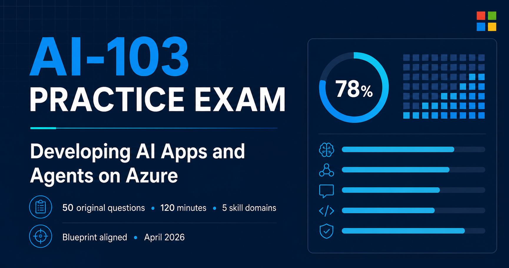

# AI-103 Practice Exam



An unofficial, browser-based practice environment for **AI-103: Developing AI Apps and Agents on Azure**.

The simulator provides a full 50-question attempt, timed and study modes, case studies, multiple item formats, answer explanations, and links to the Microsoft Learn documentation behind each question. It runs locally on Windows, macOS, and Linux and does not require an Azure subscription or external service credentials.

> [!IMPORTANT]
> This project is an independent learning tool. It is not affiliated with, endorsed by, or supplied by Microsoft. It contains original practice questions based on public documentation—not copied, recalled, leaked, or confidential exam content.

## Features

- 95 original, blueprint-aligned questions
- 50 questions selected for each attempt
- Two case studies selected from a pool of five
- 40 independent scenarios selected from a pool of 70
- Fresh question and answer ordering for every new attempt
- Exact blueprint-balanced domain coverage in every attempt
- 120-minute timed simulation and an untimed study mode
- Single choice, multiple response, build-list, matching, and Yes/No items
- Mark for review, private notes, review screens, timed breaks, and section locks
- Automatic progress saving in the browser
- Answer explanations and direct links to supporting Microsoft Learn documentation
- Domain-level scoring and a scaled practice score
- No account, database, Azure subscription, API key, or telemetry required

## Exam composition

Every attempt contains 50 questions distributed as follows:

| Skills measured | Official range | Questions per attempt |
| --- | ---: | ---: |
| Plan and manage an Azure AI solution | 25–30% | 14 |
| Implement generative AI and agentic solutions | 30–35% | 17 |
| Implement computer vision solutions | 10–15% | 6 |
| Implement text analysis solutions | 10–15% | 6 |
| Implement information extraction solutions | 10–15% | 7 |

The question selection and displayed answer order are seeded for each attempt. They remain stable while navigating or resuming an attempt, but a new attempt produces a different selection and ordering.

## Quick start

### Prerequisites

- [Node.js](https://nodejs.org/) **22.13.0 or newer**
- npm, which is included with Node.js
- A current web browser

Check your installed versions:

```bash
node --version
npm --version
```

### Install and run

Clone or download this repository. From the project directory, run:

```bash
npm ci
npm run dev
```

Open the local URL printed in the terminal, normally:

```text
http://localhost:3000/
```

Keep the terminal open while using the simulator. Press `Ctrl+C` to stop the development server.

These commands work in PowerShell, Windows Terminal, Command Prompt, macOS Terminal, and common Linux shells.

### Windows launcher

After running `npm ci` once, Windows users can double-click **Start Exam.cmd**. The launcher starts the simulator, opens the default browser, and stops the local server when you press Enter in the launcher window.

If script execution is restricted by local policy, use the standard `npm run dev` command instead.

## Production mode

To create and run a production build locally:

```bash
npm run build
npm run start
```

Open the URL printed by the server. Stop it with `Ctrl+C`.

## Available commands

| Command | Purpose |
| --- | --- |
| `npm run dev` | Start the local development server |
| `npm run build` | Create the production build |
| `npm run start` | Serve the production build locally |
| `npm test` | Build the app and run all automated checks |

## Progress and privacy

Attempt progress, answers, flags, and private notes are saved only in the browser's local storage. The application does not send exam data to a server and does not include analytics or tracking.

Browser data is specific to the site origin. Changing the port, hostname, browser profile, or device creates a separate local save. Clearing site data removes saved attempts.

## Project structure

| Path | Description |
| --- | --- |
| `app/ExamSimulator.tsx` | Exam screens, navigation, scoring, review, and persistence |
| `app/questions.ts` | Case studies, original question bank, explanations, and sources |
| `app/questionSelection.ts` | Per-attempt case and question selection with blueprint balancing |
| `app/optionShuffle.ts` | Seeded answer-order randomization |
| `app/globals.css` | Responsive simulator styling |
| `tests/` | Question-bank, selection, randomization, rendering, and build checks |
| `Start Exam.cmd` | Optional Windows launcher |

The interface is built with React and Next.js-compatible components and uses Vinext/Vite for local development and production builds.

## Content and references

The bank is aligned to the Microsoft skills measured as of **April 16, 2026**. Certification objectives and Azure services change over time, so consult the official study guide before relying on the simulator for current exam coverage.

Primary references:

- [Official AI-103 study guide](https://learn.microsoft.com/en-us/credentials/certifications/resources/study-guides/ai-103)
- [Azure AI Apps and Agents Developer Associate certification](https://learn.microsoft.com/en-us/credentials/certifications/azure-ai-apps-and-agents-developer-associate/)
- [Microsoft Foundry documentation](https://learn.microsoft.com/en-us/azure/ai-foundry/)
- [Azure AI Search documentation](https://learn.microsoft.com/en-us/azure/search/)
- [Azure AI services documentation](https://learn.microsoft.com/en-us/azure/ai-services/)
- [Microsoft certification exam duration and experience](https://learn.microsoft.com/en-us/credentials/support/exam-duration-exam-experience)

Each question also contains a direct source link for the capability being tested.

## Contributing questions

Contributions should preserve the integrity of the project:

1. Write original scenarios and answer choices in your own words.
2. Do not submit exam dumps, recalled live questions, confidential material, or content copied from commercial practice tests.
3. Align each item to a current AI-103 objective.
4. Cite an authoritative Microsoft Learn page that supports the correct answer.
5. Include a useful explanation of why the answer is correct.
6. Keep question IDs unique and preserve all configured answer types.
7. Run `npm test` before opening a pull request.

## Troubleshooting

### Node.js version error

Install Node.js 22.13.0 or newer, restart the terminal, and confirm the active version with `node --version`.

### Dependencies fail to install

Use the lockfile-based installation from the repository root:

```bash
npm ci
```

If the project was copied with an old `node_modules` directory from another operating system, remove that directory and run `npm ci` again.

### The default port is already in use

Follow the alternative local URL printed by the development server, or stop the process currently using port 3000.

### A previous attempt keeps appearing

Start a new attempt from the simulator. To remove all locally saved progress, clear site data for the simulator's local URL in your browser settings.

## Disclaimer

Microsoft, Azure, Microsoft Foundry, and Microsoft Learn are trademarks of Microsoft Corporation. Their use here is descriptive only and does not imply sponsorship or endorsement.

Passing this practice simulator does not guarantee a passing result on the certification exam. Microsoft uses its own item selection, scoring, unscored questions, and exam-delivery rules.

## License

This repository does not currently include an open-source license. Add a `LICENSE` file before inviting redistribution or external contributions; without one, standard copyright restrictions apply.
